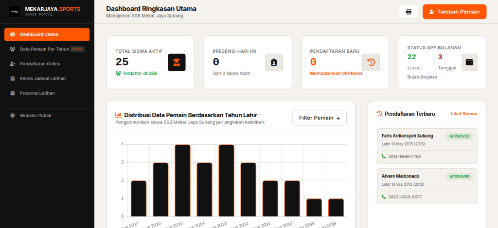
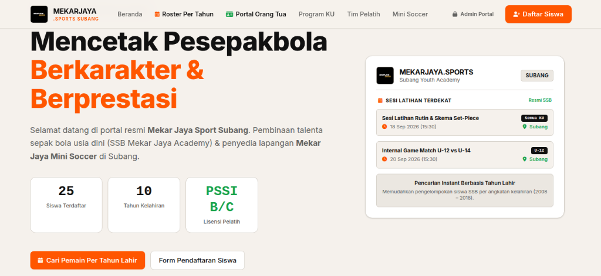
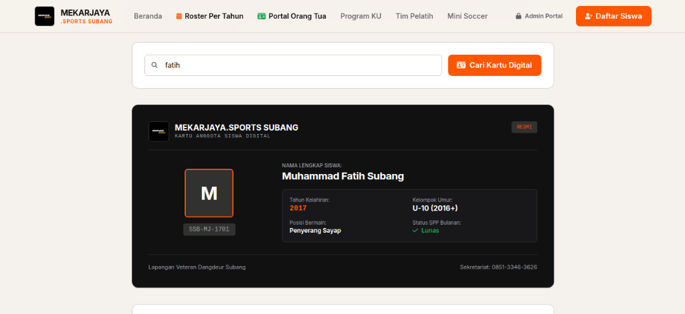
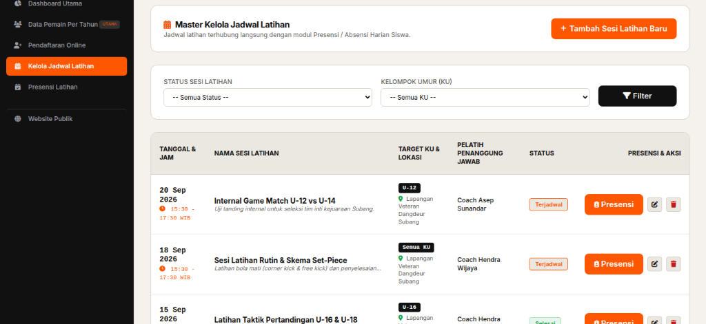
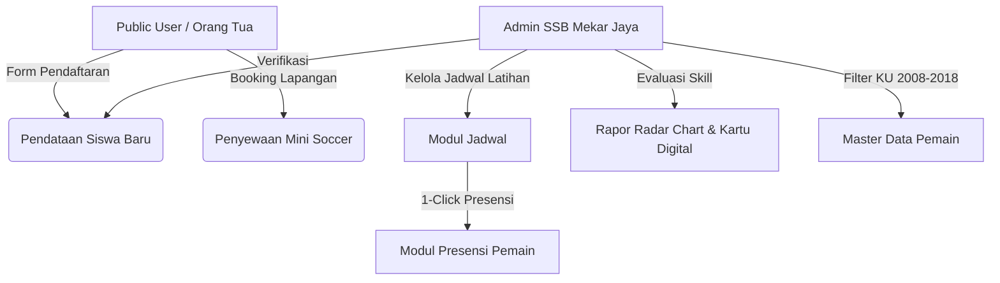

<div align="center">

  

  # ⚽ SSB MEKAR JAYA & MINI SOCCER SUBANG
  ### *Sistem Informasi Manajemen Sekolah Sepak Bola & Reservasi Lapangan Mini Soccer*

  [](https://laravel.com)
  [](https://tailwindcss.com)
  [](https://php.net)
  [](https://mysql.com)
  [](LICENSE)

  ---

  <p align="center">
    <b>Platform Digital Terpadu SSB Mekar Jaya Subang</b><br>
    Memfasilitasi pendaftaran pemain muda (KU 2008–2018), manajemen presensi terintegrasi jadwal latihan, rapor performa radar chart, kartu siswa digital, hingga penyewaan lapangan mini soccer sintetis.
  </p>

</div>

---

## 📌 Deskripsi Proyek

**Sistem Informasi SSB Mekar Jaya & Mini Soccer** merupakan platform web modern yang dirancang khusus untuk memodernisasi operasional Sekolah Sepak Bola (SSB) Mekar Jaya Kabupaten Subang. Proyek ini menyelesaikan tantangan pencarian dan pengelompokan pemain berdasarkan **Kelompok Umur (KU)** dan **Tahun Kelahiran (2008 s.d. 2018)** serta mengintegrasikan manajemen jadwal latihan dengan absensi harian pemain secara *real-time*.

> [!NOTE]
> Aplikasi ini dibangun dengan standar antarmuka **Editorial Clean Design** (Canvas Cream `#F5F1EC`, Pure White Tiles `#FFFFFF`, Ink Text `#111111`, dan Accent Fin Orange `#FF5600`), memberikan kenyamanan visual dan pengalaman pengguna (UX) yang sangat responsif baik pada tampilan Desktop, Tablet, maupun Mobile.

---

## 📸 Tampilan Antarmuka (Screenshots Showcase)

### 📊 1. Admin Dashboard Ringkasan Utama

*Ringkasan statistik siswa aktif, presensi harian, verifikasi pendaftaran baru, status SPP bulanan, serta grafik distribusi siswa per tahun lahir (2008–2018).*

---

### 🌐 2. Landing Page & Portal Publik

*Tampilan portal publik resmi SSB Mekar Jaya Subang lengkap dengan informasi akademi, pendaftaran online, dan daftar sesi latihan terdekat.*

---

### 🆔 3. Kartu Anggota Siswa Digital

*Kartu identitas anggota siswa digital SSB Mekar Jaya Subang dengan desain dark mode eksklusif, NIS, status SPP, dan pengelompokan KU.*

---

### 📅 4. Kelola Jadwal Latihan & Presensi Integrasi

*Master pengelolaan jadwal latihan per Kelompok Umur (KU) dengan tombol Presensi 1-Click ke pencatatan absensi harian siswa.*

---

## ✨ Fitur-Fitur Unggulan

### 👔 1. Sisi Admin (Management Portal)
* ** Responsive Admin Layout**: Dashboard & sidebar off-canvas yang responsif dan lancar digunakan di perangkat seluler (smartphone & tablet).
* ** Kelompok Umur & Tahun Kelahiran (2008 - 2018)**: Filter cepat data pemain berdasarkan kategori KU (KU-10, KU-12, KU-14, KU-16, KU-18) dan rentang tahun lahir 2008 hingga 2018.
* ** Rapor Performa Pemain (Radar Chart)**: Visualisasi statistik atribut teknik pemain (Pace, Shooting, Passing, Dribbling, Defending, Physical) menggunakan Chart.js.
* ** Kartu Siswa Digital & QR Code**: Generasi kartu identitas siswa digital SSB Mekar Jaya dengan logo resmi mitra dan nomor induk siswa (NIS).
* ** Kelompok Jadwal Latihan & Presensi Terintegrasi**: 
  * Fitur membuat & mengelola Jadwal Latihan spesifik per KU.
  * Tombol **"Buka Presensi"** 1-Click yang otomatis menghubungkan sesi latihan dengan pencatatan kehadiran (Hadir, Izin, Sakit, Alpa).
* ** Verifikasi Pendaftaran Siswa Baru**: Modul persetujuan/penolakan berkas pendaftaran calon siswa secara *real-time*.
* ** Kelola Lapangan & Reservasi Mini Soccer**: Pemantauan jadwal sewa lapangan rumput sintetis dan konfirmasi pembayaran.
* ** Export Roster Cetak**: Cetak daftar anggota tim/roster siap pakai untuk turnamen atau event resmi.

### ⚽ 2. Sisi Publik / Orang Tua / Pemain
* ** Landing Page Interaktif**: Informasi profil SSB Mekar Jaya, jadwal latihan terbaru, dan galeri fasilitas.
* ** Form Pendaftaran Online**: Pendaftaran calon siswa baru secara mandiri tanpa harus datang ke sekretariat.
* ** Booking Lapangan Mini Soccer**: Antarmuka pemesanan jam main lapangan sintetis mini soccer yang transparan dan fleksibel.

---

## 🛠️ Teknologi yang Digunakan

* **Back-End Framework**: [Laravel 11.x](https://laravel.com)
* **Front-End Framework / Styling**: [Tailwind CSS v3.x](https://tailwindcss.com) & [Alpine.js](https://alpinejs.dev)
* **Database Engine**: [MySQL 8.0+](https://www.mysql.com)
* **Chart & Visualisasi**: [Chart.js v4](https://www.chartjs.org)
* **Iconography**: [Heroicons](https://heroicons.com) & Lucide Icons
* **Local Web Server**: Apache / Nginx (XAMPP / LAMPP compatible)

---

## 📊 Arsitektur & Alur Data



---

## 🚀 Panduan Instalasi & Penggunaan

Ikuti langkah-langkah berikut untuk menjalankan proyek ini di lingkungan lokal Anda:

### 1. Prasyarat Sistem
* PHP >= 8.2
* Composer >= 2.x
* Node.js >= 18.x & NPM
* MySQL Database (XAMPP / LAMPP / Docker)

### 2. Kloning Repositori
```bash
git clone https://github.com/dapaaa07/mekarjaya-sports.git
cd mekarjaya-sports
```

### 3. Instalasi Dependensi PHP & JavaScript
```bash
composer install
npm install
```

### 4. Konfigurasi Environment (`.env`)
Salin file `.env.example` menjadi `.env`:
```bash
cp .env.example .env
```
Sesuaikan konfigurasi database pada file `.env`:
```env
DB_CONNECTION=mysql
DB_HOST=127.0.0.1
DB_PORT=3306
DB_DATABASE=mekarjaya_db
DB_USERNAME=root
DB_PASSWORD=
```

### 5. Generate Application Key & Jalankan Migrasi + Seeder
```bash
php artisan key:generate
php artisan migrate:fresh --seed
```

### 6. Build Asset Frontend & Jalankan Web Server
```bash
# Terminal 1: Build & Watch asset CSS/JS
npm run dev

# Terminal 2: Jalankan Laravel Local Server
php artisan serve
```
Akses aplikasi melalui browser di `http://127.0.0.1:8000`.

---

## 🔑 Kredensial Login Default (Seeder)

> [!IMPORTANT]
> Gunakan akun berikut setelah menjalankan perintah `php artisan migrate:fresh --seed`:

| Peran (Role) | Email / Username | Password | Akses URL |
| :--- | :--- | :--- | :--- |
| **Administrator** | `admin@mekarjaya.com` | `password` | `/admin/login` atau `/login` |
| **Pelatih / Staf** | `coach@mekarjaya.com` | `password` | `/admin/schedules` |

---

## 📁 Struktur Direktori Utama Proyek

```text
mekarjaya/
├── app/
│   ├── Http/Controllers/Admin/   # Controller Admin (Player, Schedule, Attendance, Field, Registration)
│   └── Models/                   # Model Eloquent (Player, Schedule, Attendance, Registration, Field)
├── database/
│   ├── migrations/               # Skema Migrasi Database
│   └── seeders/                  # Seeder Data Pemain, Jadwal, KU 2008-2018
├── docs/
│   └── screenshots/              # Screenshot Tampilan Aplikasi (Dashboard, Landing, Kartu Digital, Jadwal)
├── public/
│   ├── images/
│   │   └── logo-mekarjaya.jpg    # Logo Resmi Mitra SSB Mekar Jaya Subang
│   └── favicon.ico
├── resources/
│   ├── views/
│   │   ├── admin/                # View Blade Portal Admin (Responsive UI)
│   │   ├── layouts/              # Layout Blade Admin & Public
│   │   └── welcome.blade.php     # Public Landing Page & Booking
│   └── css/app.css               # Styling Tailwind & Design System Custom
├── routes/
│   └── web.php                   # Route Aplikasi & Middleware Admin
└── README.md
```

---

## 🤝 Kontribusi & Lisensi

Hak Cipta © 2026 **SSB Mekar Jaya Subang & Mini Soccer**. 
Dikembangkan untuk pengabdian dan digitalisasi olahraga daerah. Lisensi perangkat lunak ini berada di bawah [MIT License](LICENSE).

<div align="center">
  <sub>Dibuat dengan ❤️ untuk kemajuan sepak bola usia dini Indonesia.</sub>
</div>
